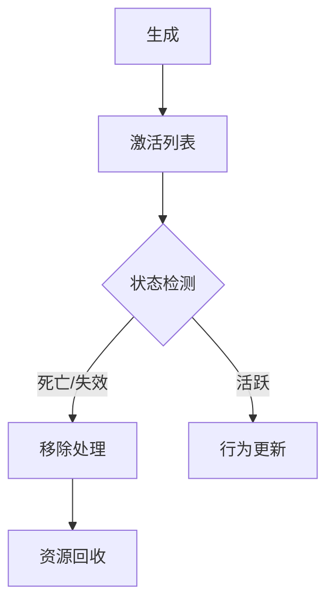
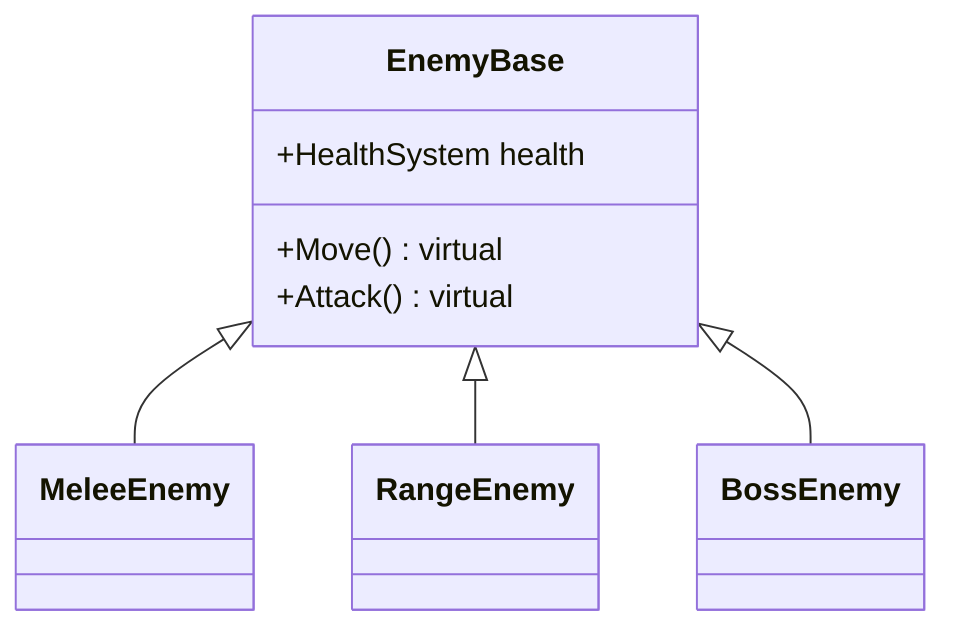

# Unity中的敌人管理系统：原理与实践

  
*敌人管理系统架构示意图*

在游戏开发中，敌人管理是一个复杂而关键的系统，它需要协调多个敌人的行为、状态和与玩家的交互。本文将深入解析敌人管理系统的设计原理与实现细节。

## 🏗️ 系统架构设计

### 单例模式实现
```csharp
public class EnemyManger : Singleton<EnemyManger>
{
    private Transform _mainPlayer;
    [SerializeField, Header("所有的敌人")] 
    private List<GameObject> _allEnemy = new List<GameObject>();
    
    [SerializeField, Header("激活着的敌人")] 
    private List<GameObject> _activeEnemy = new List<GameObject>();
    
    private WaitForSeconds _waitTime;
}
```

关键设计特点：
- 🔒 全局单例访问点
- 📋 双列表管理（全量+活跃）
- 🛠️ 编辑器友好配置

## ♻️ 敌人生命周期管理

### 完整生命周期流程图


### 代码实现
```csharp
public void RemoveEnemyUnit(GameObject obj)
{
    Debug.Log($"移除敌人: {obj?.name}");
    
    if (obj == null) return;
    
    if (_activeEnemy.Contains(obj))
    {
        DisableEnemyComponents(obj); // 关键步骤！
        _activeEnemy.Remove(obj);
    }
}
```

禁用组件标准流程：
1. 移动控制组件
2. 战斗脚本
3. 所有碰撞体
4. 设置死亡动画标志

## 🤖 AI行为控制系统

### 攻击指令分发算法
```csharp
IEnumerator EnableEnemyAttackCommand()
{
    while (_activeEnemy.Count > 0)
    {
        CleanInvalidEnemies(); // 清理无效敌人
        
        if (_activeEnemy.Count == 0) break;
        
        GameObject attacker = SelectRandomAttacker();
        if (attacker.TryGetComponent<EnemyCombatt>(out var combat))
        {
            combat._attackcommand = true;
        }
     
        yield return _waitTime; // 控制攻击频率
    }
}
```

AI控制参数表：

| 参数 | 作用 | 推荐值 |
|------|------|--------|
| `_waitTime` | 攻击间隔 | 1.5-3.0s |
| 随机选择 | 攻击者选择 | 均匀分布 |
| 状态检查 | 死亡检测 | 每帧执行 |

## 🎮 全局行为控制

### 特殊场景处理
```csharp
// 处决动画期间
public void StopAllEnemies()
{
    foreach (var e in _activeEnemy)
    {
        if (e.TryGetComponent<EnemyCombatt>(out var combat))
        {
            combat.StopAttackCommand();
        }
    }
}
```

使用场景：
- 🎬 过场动画
- ✨ 特殊技能释放
- 💀 玩家处决时刻

## 🔗 系统集成设计

### 与玩家系统的交互
```csharp
// 玩家战斗系统
EnemyManger.MainInstance.StopAllEnemies();
GameEventMag.MainInstance.CallEvent("敌人死亡", enemyTransform);
```

集成方式：
1. **直接调用**：通过单例访问
2. **事件驱动**：使用消息系统
3. **组件查询**：GetComponent模式

## 🧠 设计模式应用

| 模式 | 应用场景 | 实现示例 |
|------|----------|----------|
| 单例 | 全局访问 | `EnemyManger.Instance` |
| 观察者 | 事件通知 | `CallEvent("敌人死亡")` |
| 状态 | 生命周期 | `IsDead`标志位 |
| 组件 | 功能分离 | 移动/战斗/健康组件 |

## 🚀 性能优化技巧

1. **对象池管理**：
   ```csharp
   EnemyPool.Instance.Recycle(enemy);
   ```
   
2. **距离检测优化**：
   ```csharp
   if(Vector3.Distance() > threshold) return;
   ```

3. **分帧处理**：
   ```csharp
   yield return new WaitForEndOfFrame();
   ```

## 🔮 扩展方向

### 敌人类型扩展架构


扩展建议：
1. 行为树集成
2. 难度动态调整
3. 阵营系统添加

## 📝 总结与最佳实践

核心原则：
- 🧩 **模块化设计**：功能分离，职责单一
- ⚡ **性能意识**：及时清理，优化检测
- 🎮 **体验优先**：合理的AI难度曲线
- 🔄 **灵活扩展**：预留接口，方便迭代

> "优秀的敌人管理系统应该像交响乐指挥——每个敌人都独立演奏，但整体和谐统一。" — 资深游戏开发者

---

**📚 推荐阅读**：
- [Unity官方AI教程](https://learn.unity.com/topic/artificial-intelligence)
- [游戏编程模式](https://gameprogrammingpatterns.com/)
- [行为树实现指南](https://www.behaviordesigner.com/)


