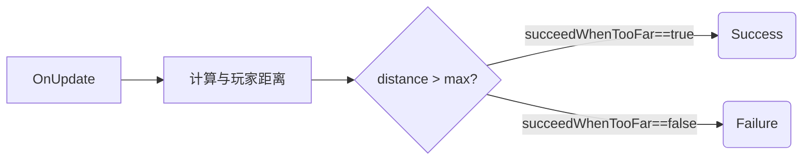
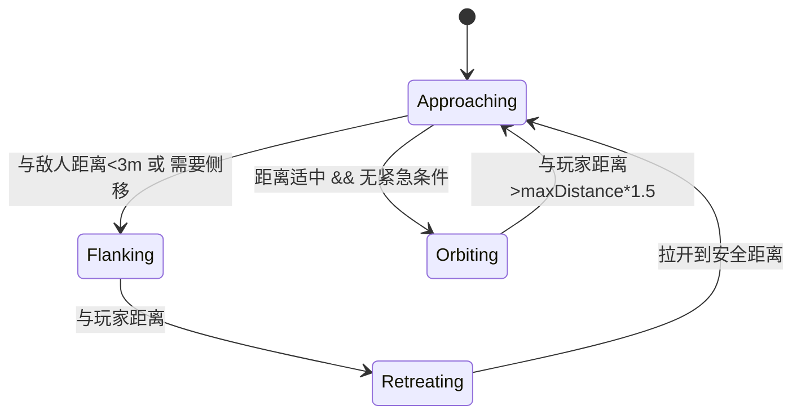
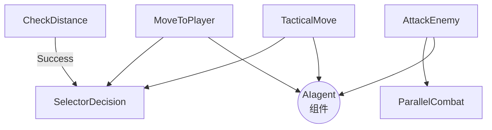

# 行为树节点源码拆解（为 **Behavior Designer** 编写）

下列 4 份脚本全部继承自 `BehaviorDesigner.Runtime.Tasks.Task` 系列  
（`Conditional` / `Action`），因此遵守相同的生命周期：

| 方法            | 何时调用 | 典型作用 |
|-----------------|----------|----------|
| `OnAwake()`     | 节点第一次被创建时 | 取缓存、GetComponent |
| `OnStart()`     | 节点进入 **Running** 之前 | 初始化计时器、动画、黑板数据 |
| `OnUpdate()`    | 每帧调用 | 核心逻辑（返回 Success/Failure/Running） |
| `OnEnd()`       | 结束（Success/Failure） | 收尾、复位状态 |

---

## 1. `CheckDistanceFromPlayer` (Conditional)

知识点  
1. 双路径判断：`succeedWhenTooFar` 让同一节点既能当「超出距离 ➜ Success」也能反转用。  
2. 玩家 `Transform` 获取优先级  
   * 先用外部注入的 `SharedTransform`  
   * 否则用 `FindWithTag`（一次性缓存到 `OnStart`，避免每帧查找）  
3. 缓存引用后不再使用 tag/黑板搜索，减少 GC。

---

## 2. `MoveToPlayerPosition` (Action)

### 逻辑分层

1. **目标检测**  
   * 距离 ≤ `targetDistance + arrivalThreshold` ➜ **Success**  
   * 超时 (`useTimeout`) ➜ **Failure**

2. **路径更新**  
   * 玩家移动超过 1m 或 0.5 s 未更新 ➜ 重算方向

3. **移动执行**  
   * 基础方向 = `toPlayer.normalized`  
   * 冲刺：距离 > `targetDistance*2` → 乘 `sprintSpeedMultiplier`  
   * 避障：`SphereCast` + 选左右哪侧更通畅 + `Lerp` 混合

4. **动画**  
   `Animator.SetFloat("Speed" , 0.8f / 0)` 在 **Start/End** 两端设置，避免残留。

### 知识点

* 「**Running-型 Action**」——只在 `OnUpdate` return Running，让父节点持续轮询。  
* 用 **SharedTransform** 使行为树黑板可复用；同样的节点可以拖到别的 BT 上。  
* 避障策略：  
  `Cross(Vector3.up, moveDir)` 给出与前进方向垂直的左右方向，再通过两次 Raycast 选“路更长”的。

---

## 3. `TacticalCompanionMovement` (Action)

这是一个 **伴随/环绕式 AI**，功能最复杂，内部再细分为四个“运动状态”：

### 核心技术点

1. **敌人管理**  
   * `OverlapSphere` 每 `targetUpdateInterval` s 扫描  
   * 过滤死亡敌人（读取自定义 `Ghosty` 状态机）  
   * 最近敌人写入黑板，供其它节点使用

2. **多因素移动**  
   * 与玩家距离 (`min/maxDistance`)  
   * 敌人距离  
   * 障碍物 (`AvoidObstacles`)  
   * 随机化 + 时间阈值，避免同步抖动

3. **运动平滑**  
   `Vector3.SmoothDamp` 将 *targetVelocity* 过渡到 *currentVelocity*  
   + “方向突变检测” (`Vector3.Distance(newTargetVelocity,targetVelocity)>1`) 防抽搐

4. **面向优先级系统**  
   `aiAgent.TurnToFace(target, speed, FacingPriority)`  
   通过优先级枚举解决「移动逻辑想面玩家 / 战斗逻辑想面敌人」的冲突。

5. **动画**  
   * 使用速度大小 + 正负号区分前进/后退  
   * `Lerp` 写 Animator 以平滑过渡

---

## 4. `ConditionalAttackEnemy` (Action)

> 名为 *Conditional* 但继承自 `Action`，返回值永远 Running，相当于“常驻服务节点”。

### 整体流程

1. **定时扫描敌人** (`updateInterval`)  
   * 结果写到 `SharedTransformList detectedEnemies`  
   * 最近活敌写到 `nearestEnemy` 并缓存到 `aiAgent.CurrentTarget`

2. **攻击逻辑**  
   * cooldown (`aiAgent.CooldownTimer`)  
   * 射程判定 (`attackRange`)  
   * 连射上限 (`maxShotsBeforeCooldown`) ➜ 自动进入冷却  
   * `aiAgent.ShootAtTarget(position)` 真正开火

3. **旋转**  
   始终调用 `aiAgent.TurnToFace(nearestEnemy, turnSpeed, FacingPriority.Combat)`  
   ——用 Combat 优先级压过普通移动。

### 小技巧

* **性能**：检测+排序只在定时器到期时执行，而不是每帧 Overlap。  
* **容错**：节点本身不返回 Failure；即使一帧内没敌人，也让行为树继续往下跑。

---

## 5. 脚本之间的协同

* `AIagent` 提供统一接口：  
  `Velocity` / `TurnToFace` / `SetFacingDirection` / `ShootAtTarget` / Animator param。  
* 行为树可用 **Selector / Parallel / Decorator** 等节点将四个 Task 组合：  
  1. 先用 `CheckDistanceFromPlayer` 判断是否需要远距离追赶  
  2. 距离合适时进入 `TacticalCompanionMovement`（更花哨的微操）  
  3. `ConditionalAttackEnemy` 常驻并随时打断面向  
  4. `MoveToPlayerPosition` 是最朴素 fallback

---

## 6. 可再优化的点

1. **Job 或 Burst**：`OverlapSphere` 对大批 AI 仍重；可改 ECS 批量检测。  
2. **NavMesh**：若场景复杂，可把**避障**+**寻路**改成 `NavMeshAgent`，保持同样的行为状态机。  
3. **冷却条**：`ConditionalAttackEnemy` 里“每次射击都算一次 cooldown”可改成动画事件或武器脚本。  
4. **状态权重学习**：把 `MovementState` 转成 Utility AI，计算分数而非硬编码阈值。  
5. **对象池 & Burst Raycast**：`SphereCast` / `Raycast` 频繁分配 `RaycastHit`；可用 `Physics.RaycastNonAlloc`.

---

### 一句话总结

这组脚本展示了 **行为树** + **黑板共享变量** + **AIagent 统一服务层** 的典型结构；  
通过 `__UpdateInterval__`、随机扰动、速度平滑、优先级面向等手段减少了**性能开销**和**视觉抖动**，最终实现了“跟随-环绕-侧翻-射击”的战术伙伴 AI。