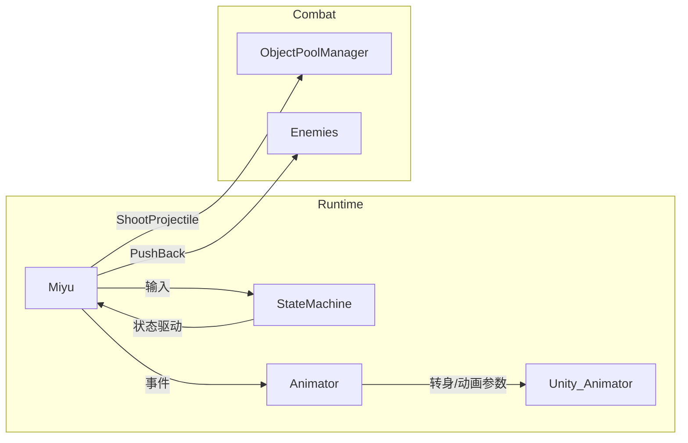

# 玩家端脚本解剖（俯视射击）

---

## 0. 模块总览



* **Miyu.cs** 核心数据 + 行为  
* **MiyuStateMachine.cs** 有限状态机（Grounded / Dead）  
* **MiyuAnimator.cs** 动画、朝向、护盾特效  
* 依赖基类/接口：`PossessableAgent<Input>`、`IHurtable`…  
* **Input System**：`Miyu.input` 持有  
  `desiredMovement` (Vector2), `shoot` (bool), `targetPositionWS` (Vector3)

---

## 1. 数据与组件解耦

### Scriptable-Obj 包装

| 字段类型                 | 用途                         | 特点                           |
|--------------------------|------------------------------|--------------------------------|
| `LinearFloat / Int`      | 可升级/插值的数值            | `.Value`、`.BaseValue`、`.Limiter` |
| `LinearLimiter*`         | 具有限制（血量、子弹槽）     | `.Value` 自动 Clamp 到 `[0,Limiter]` |
| `Timer` (struct)         | 隐式转换为 `bool` & 递减     | 写 `timer = 1f` 即开始倒计时    |

好处：  
1. **运行时可调** —— Inspector 面板实时修改。  
2. **扩展性** —— 升级、Buff 直接操作 SO 而非脚本字段。

---

## 2. 移动与转身

```csharp
Vector3 desiredVelocity = input.desiredMovement * movementSpeed.Value;
miyu.Velocity = Mathx.Damp(Vector3.Lerp, miyu.Velocity, desiredVelocity,
        accelOrDecelAlpha, Time.deltaTime);
```

* `Mathx.Damp`：在 **加速 / 减速** 两套 alpha 之间切换，获得更自然的惯性。  
* `TurnToFace(directionToFace, TurnSpeed)` 在 `LateUpdate` 里调用，确保 **RootMotion** 之前完成旋转。  
* 当玩家静止时，方向改由 `input.targetPositionWS` 决定，保证“站立转枪口”。

---

## 3. 射击机制

### 3.1 Fire-Rate & Magazine

```csharp
timeSinceLastAttack * attackSpeed.Value > 1
```

* fire rate = `attackSpeed` **发 / 秒**  
* 装弹计数 `magazine.Value`；为 0 时开始 **自动换弹**：
  ```
  timeLeftUntilReload = 1 / reloadRate.Value
  if (timeLeftUntilReload<=0) magazine.Value = magazine.Limiter
  ```

### 3.2 子弹实例化

```csharp
Projectile bullet = ObjectPoolManager.Instance.Borrow(scene,
        projectilePrefab[palette.Value], BulletSource.position, BulletSource.rotation);
```

1. **对象池复用** —— 降低 GC / Instantiate 开销。  
2. **多发 & 散布**  
   * `projectileCount` 循环  
   * 在 ±`projectileSpread/2` 度范围内 **线性插值** θ  
   * `Quaternion.Euler(0, rotDegrees, 0) * direction`

3. **弹丸属性** — 通过参数初始化一次性传入（伤害、穿透、反弹…）。

### 3.3 射击事件

```csharp
OnShootEvent?.Invoke();
```

* `MiyuAnimator` 订阅事件，用 **定时器 ➜ 切到 Shoot 动画**。  
* 其他系统（Camera Shake / Muzzle Flash）也可监听。

---

## 4. 受伤 & 护盾

```csharp
if (shield.Value >= 1)        // 先扣护盾
else                          // 扣血量
```

* **护盾自回复**：`shield += regenRate * Δt(min)` —— 以“每分钟” 为单位。  
* **i-frame**：写 `iframeHappening = iframeSeconds`，`ValidateHit()` 阻挡新伤害。

### 推开所有敌人

```csharp
foreach (enemy in allEnemies) enemy.ApplyKnockback(strength * attenuation, dir);
```

* 衰减依据 **距离 → Ease 曲线**  
* 死亡时再来一次 **更强 knockback**（忽略免疫）

---

## 5. 动画系统 (`MiyuAnimator`)

### 5.1 状态机（内部枚举而非 Animator 状态机）

| 枚举值   | 进入条件                           | 退出条件 |
|----------|------------------------------------|----------|
| Normal   | 默认                               | 子弹耗尽 / Shoot |
| Reload   | `!HasBullet`                       | `HasBullet` |
| Shoot    | `OnShootEvent` 计时器 > 0          | 计时器结束 / 弹尽 |
| Dead     | `Miyu.IsDead`                      | 永久     |

> 真正的切换靠 `Animator.SetInteger(param_State, (int)currentState)`  
> 在 Animator Controller 里再用 *Int* 参数做 Motion Blend。

### 5.2 速度与倒退混合

```csharp
speedParam = (aimOppositeOfVelocity) ? -|v| : |v|
Anim.SetFloat("Speed", speedParam)
```

* `BlendTree` 把 `Speed<0` 当作 **后退动画**。  
* 计算“枪口方向和移动方向相反”时才取反。

### 5.3 护盾 FX

* `shieldOn` 物体 ± `shieldCharge` / `shieldBreak` 粒子  
* 检测 **从 ≥1 降到 <1** 与 **从 <1 升到 ≥1** 两种边界事件。

---

## 6. 状态机实现细节

```csharp
StateMachine.Blackboard // Dictionary<object,object?>
```

| 键                | 说明                 |
|------------------|----------------------|
| `"lastAttackTime"` | 上一次开火的 `Time.time` |
| `"timeLeftUntilReload"` | 当前弹夹剩余装填时间 |

好处：  
* **局部黑板** —— 与全局 BT Blackboard 区分，易于迁移到别角色。  
* 纯 C# Dictionary，类型由节点自己约定。

---

## 7. 知识点速览

* **Input System ➜ 数据类**  
  `PossessableAgent<Input>` 把 Unity 新输入回调封装进 `input.{field}`，AI/动画层不直接依赖 Input API。  
* **对象池 + DOTween**  
  子弹与特效全部池化；推开敌人时用 `enemy.transform.DOMove(...)` 可重构为纯物理。  
* **可升级数值**  
  ScriptableObject 方案让《Rogue-like》风格升级极其方便。  
* **Timer 隐式转换**  
  写起来像 `float`，读起来像 `bool`，是优雅的小技巧。  
* **动画转身**  
  “静止→瞄准方向”，“移动→速度方向”，并在处于 *镜像跑* 时自动倒放 Run 动画。

---

### 一句话总结

玩家端逻辑围绕 **“输入 → 运动 → 射击 → 动画/特效”** 四轴展开：  
1. **Input** 决定移动向量和是否开火；  
2. **StateMachine** 处理移动阻尼、射速、弹夹与换弹；  
3. **Miyu** 执行实际射击/伤害/推力并广播事件；  
4. **Animator** 收听事件，驱动人物朝向、速度 Blend 与护盾 VFX。  

整体遵循「数据层（Scriptable）↔ 行为层（State）↔ 表现层（Animator）」清晰分层，易于调参与扩展。